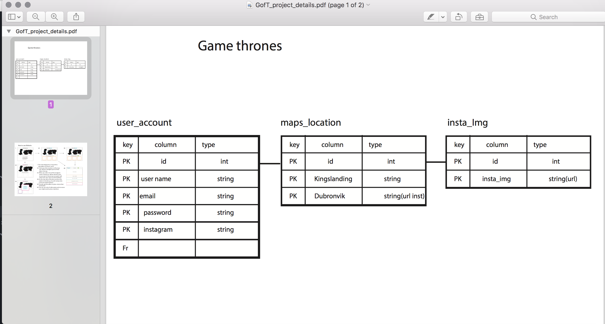
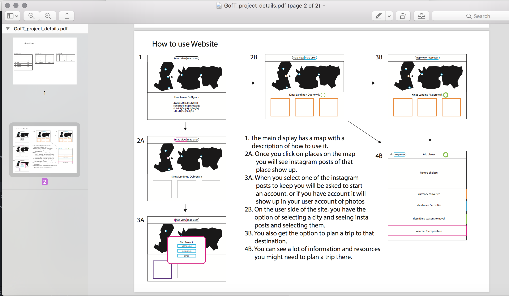

# project2

Game of Thrones || Globe Trott

*************************************************

### WDI PROJECT 2

#### Original App Created By: Brett Kalwarlski and Victoria Fajardo
************************************************
**Technologies Used:**
- HTML
- CSS
- SASS
- GULP
- MySQL
- Node JS
- Express
- Javascript
- jQuery
- Materialize/Skeleton
- Github
- Preferred web browser will be Chrome and Safari.

**CONCEPT/PURPOSE:**
What's this app all about?

Game of Thrones Globe Trott is a photo sharing app for all you travel junkies out there.
We’ve compiled a list of the top 5 country's for GOT film destination locations.
We want this to help inspire your next trip.
GOT shoots largely on-location, primarily in Northern Ireland and
Iceland for scenes in the North, and Croatia and Spain for the South.
With such an impressive roster of medieval cities and stunning islands on
their shoot list, it should come as no surprise that a GOT location tour around
Europe would make for an ideal vacation.

Feel free to sign-in share an image or post a comment to help inspire others.

**ORIGINAL WIREFRAMES**
<!--  -->

**APP FEATURES:**
Theme of the app is inspired by the beautiful film locations.  The artistic design of the banner, logo, border and map are detail oriented.  The user is able to create an new account with return user log-in a session functionality and log out.  The user is able to upload share and include a caption to their image. An carousel gives user the ability to flip through images for each country's location.  

**INSTALLATION INSTRUCTIONS**
Application is not yet deployed online

**UNSOLVED PROBLEMS**
- API installation
- linking all the pages

**FUTURE OF APP**
- To include a Post a Comment and Reply to a Comment. Also, we would like user to be able to upload a photo image/avatar to their profile, as well as Save an image or Vote up or down for an image and keep track of score.  We would like to also name and list popular must see places, hotels and film locations for each country.
